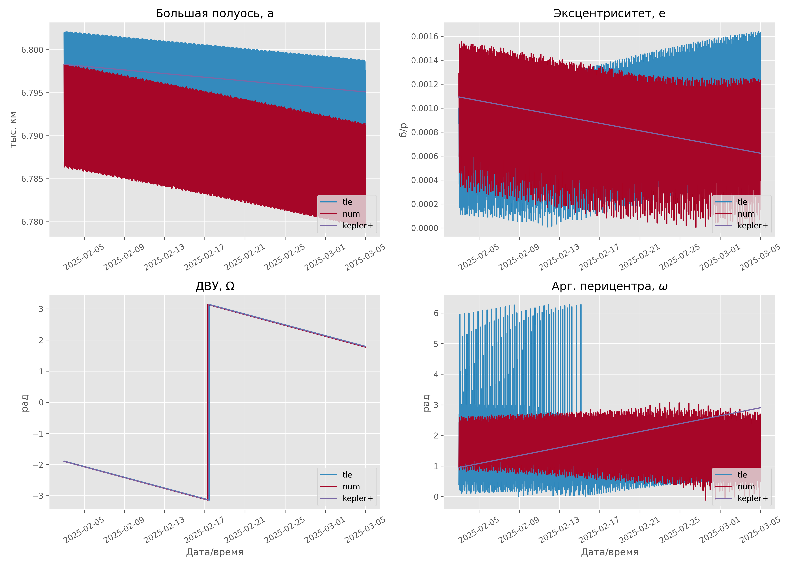

# Kepler-Equation-Problems

Лабораторные работы по небесной механике и теории движения искусственных
спутников Земли. В проекте на языке Python реализованы прогнозирование орбиты
спутника с учётом возмущений (сопротивление атмосферы, нецентральность поля
тяготения Земли) и сравнение разных методов прогнозирования движения.

В основе всех расчётов лежит решение **уравнения Кеплера** `M = E − e·sin E`
и переход между оскулирующими элементами орбиты и вектором состояния.

## Содержание работ

### Задача 1 — Сход спутника с орбиты (`Lab1.py`)

Интегрирование уравнений Гаусса для оскулирующих элементов
`α = (a, e, i, Ω, ω, M)` методом Рунге–Кутты 4-го порядка. Единственное
учитываемое возмущение — торможение в атмосфере. Расчёт ведётся от начальных
условий (вектор положения и скорости МКС) до момента, когда высота над
эллипсоидом опускается ниже 150 км, либо до достижения предельного времени
(3 месяца).

На выходе: факт схода с орбиты, время падения, конечные геодезические
координаты (широта, долгота, высота) точки над поверхностью Земли.

### Задача 2 — Сравнение моделей прогнозирования (`Lab2.py`)

Прогноз движения спутника на 30 суток тремя независимыми способами и сравнение
эволюции элементов орбиты `a, e, Ω, ω`:

- **num** — численное интегрирование (`scipy.integrate.solve_ivp`, метод RK45) с
  учётом нецентрального поля тяготения и торможения атмосферы;
- **tle** — модель **SGP4** по данным TLE (библиотека `sgp4`);
- **kepler+** — аналитическая модель с вековыми возмущениями от `J₂`.

Результат сохраняется в `lab_02_results_styled.png` — четыре графика эволюции
большой полуоси, эксцентриситета, долготы восходящего узла и аргумента
перицентра.



## Структура проекта

| Файл | Назначение |
|------|------------|
| `Lab1.py` | Задача 1: сход спутника с орбиты под действием атмосферы |
| `Lab2.py` | Задача 2: сравнение численной модели, SGP4 и аналитики |
| `extra.py` | Общая библиотека для задачи 1 |
| `harm.py` | Ускорение от нецентрального поля тяготения (сферические гармоники) |
| `lab_02_results_styled.png` | Итоговые графики задачи 2 |
| `LICENSE` | Лицензия MIT |

### Что внутри `extra.py`

- физические константы (`muE` — гравитационный параметр Земли и др.);
- табличная экспоненциальная модель плотности атмосферы `calc_rho_atm`;
- интегратор Рунге–Кутты 4-го порядка `rk4`;
- решатель уравнения Кеплера методом Ньютона `solve_kepler`;
- преобразования «элементы ↔ вектор состояния» (`elems2state`, `state2elems`);
- перевод прямоугольных координат в геодезические `xyz2llh`;
- матрица поворота в гринвичскую систему координат `rotate_to_earth`;
- базисные векторы орбитальной системы `pq_from_elems`.

### Что внутри `harm.py`

Функция `calc_geop_accel` вычисляет ускорение от несферичности поля тяготения
Земли через разложение геопотенциала по сферическим гармоникам до степени и
порядка `N_MAX = 4`, используя рекуррентные соотношения для присоединённых
функций Лежандра и нормированные коэффициенты `C_nm`, `S_nm`.

## Системы единиц

В коде используется масштабированная система единиц:

- расстояние — тысячи километров (тыс. км);
- время — тысячи секунд (тыс. сек);
- скорость — км/с (что совпадает с тыс. км / тыс. сек).

> Примечание: `Lab2.py` частично работает в километрах и секундах — обратите
> внимание на переводы единиц внутри файла.

## Требования

- Python 3.9+
- NumPy
- Matplotlib
- SciPy (для `Lab2.py`)
- sgp4 (для `Lab2.py`)

Установка зависимостей:

```bash
pip install numpy matplotlib scipy sgp4
```

## Запуск

Задача 1:

```bash
python Lab1.py
```

Задача 2:

```bash
python Lab2.py
```
